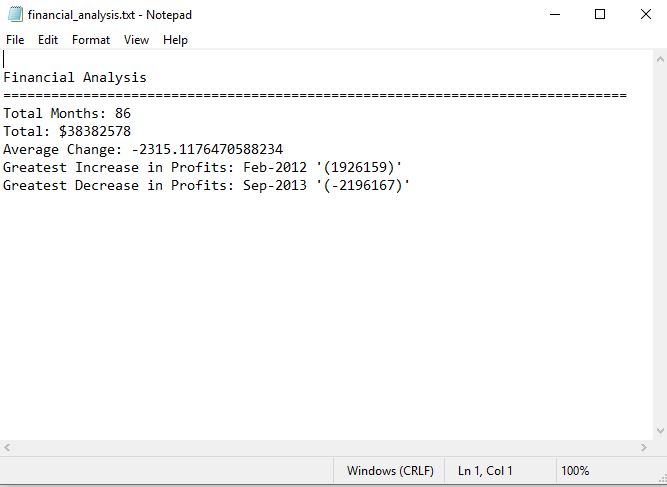

# Analysis of Financial Records Using Python

## Project Scope:

Created a Python script for analyzing the financial records, and producing a summary of the number of months included, net profits and losses, average change in profit and losses, greatest increase and decrease in profits. Lastly, the results are exported to a text file.

### Prerequisites
To replicate the examples in my repositories, you will need:
- Python3.7
- Jupyter Notebook (From Ananaconda)
- Import OS and CSV

## Getting Started:
- Download or clone the repository; should include (main.py and resources folder)
- Navigate into the folder using the command lind (cmd) - Windows or terminal (MAC), and execute: python main.py
- Check back in the resource folders for the text file results: financial_analysis.txt

## Output:

## Authors

* **Johneson Giang** - *Initial work* - [Github](https://github.com/jhustles)

## License

This project is licensed under the MIT License - see the [LICENSE.md](LICENSE.md) file for details